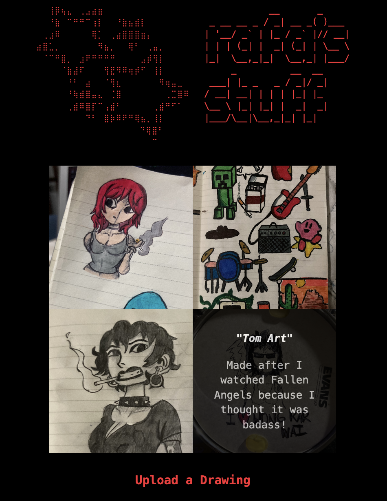

```txt
⠀⠀⢸⡿⢦⣄⠀⢀⣠⣴⣶⠀⠀⠀⠀⠀⠀⠀⠀⠀⠀⠀⠀⠀⠀
⠀⠀⠘⣷⠀⠉⠛⠛⠉⢰⡇⠀⠀⠘⣷⣦⣾⡇⠀⠀⠀⠀⠀⠀⠀
⠀⢀⣰⠿⠀⠀⠀⠀⠀⢿⡁⠀⢀⣴⣿⣿⣿⣶⡄⠀⠀⠀⠀⠀⠀
⣴⣿⣁⡀⠀⠀⠀⠀⠀⠀⠻⣦⡀⠀⠀⢿⠃⠀⢀⣤⡀⠀⠀⠀⠀
⠀⠈⠉⠛⣿⡀⠀⣰⠟⠛⠛⠛⠛⠀⠀⠀⠀⣠⡾⢻⡇⠀⠀⠀⠀
⠀⠀⠀⠀⠈⣷⣼⠏⠀⠀⠀⢻⣟⠻⠿⢶⡾⠋⠀⢸⡇⠀⠀⠀⠀
⠀⠀⠀⠀⠀⠘⠃⠀⣴⠀⠀⠈⢻⣆⠀⠀⠀⠀⠀⠀⠻⢶⣤⣀⠀
⠀⠀⠀⠀⠀⠘⢷⣾⣿⣤⣄⠀⢈⣿⠀⠀⠀⠀⠀⠀⠀⢀⣉⣿⠿
⠀⠀⠀⠀⠀⢀⣾⠿⣿⡏⠉⢠⣾⠃⠀⠀⠀⠀⠀⢀⣾⠛⠋⠁⠀
⠀⠀⠀⠀⠀⠀⠀⠀⠙⠃⠀⣿⡷⠿⠟⠛⢿⣦⡀⢸⡇⠀⠀⠀⠀
⠀⠀⠀⠀⠀⠀⠀⠀⠀⠀⠀⠀⠀⠀⠀⠀ ⠙⢿⣿⠃⠀⠀⠀⠀
⠀⠀⠀⠀⠀⠀⠀⠀⠀⠀⠀⠀⠀⠀⠀⠀⠀⠀ ⠉
```

Welcome!

This is a self-hosted fullstack app built for me to share my drawings, music, programming, and just about anything I want ( and have the will to implement infrastructure/UI for! )

It's basically like a MySpace or an Instagram, but with MY rules, MY code, and MY style ;)

Maybe it's not as polished, modern, or functional as Instagram (or even MySpace!), but every single line of code was put there by me, and every part of this was made artisanally and with intention and love. 

It's really more of an art project than a programming one :)

It's also meant to be a learning exercise, because when I do things by hand and force myself to struggle, I learn *a lot* more! 

Below are some screenshots of the project as it comes together.

Enjoy!

---

 

Drawings museum as of 2026-03-18; been having lots of fun building the backend from scratch in Go! See its [README](backend/README.txt).
